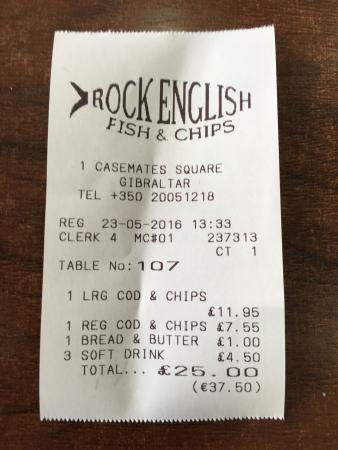

# Receipt Scanner Proof of Concept
### Credit: https://github.com/mre/receipt-parser

Example Usage:



# A fuzzy receipt parser written in Python  

[](https://travis-ci.org/mre/receipt-parser)  
  
Updating your housekeeping book is a tedious task: You need to manually find the shop name, the date and the total from every receipt. Then you need to write it down. At the end you want to calculate a sum of all bills. Nasty. So why not let a machine do it?

This is a fuzzy receipt parser written in Python. You give it any dirty old receipt lying around and it will try its best to find the correct data for you.

It started as a hackathon project. Read more about it on the [trivago techblog](http://tech.trivago.com/2015/10/06/python_receipt_parser/).
Also read the comments on [HackerNews](https://news.ycombinator.com/item?id=10338199)
Oh hey! And there's also a [talk online](https://www.youtube.com/watch?v=TuDeUsIlJz4) now if you're the visual kind of person.

## Dependencies

* [Tesseract Open Source OCR Engine](https://github.com/tesseract-ocr/tesseract)
* [ImageMagick](http://www.imagemagick.org/script/index.php)

## Usage

To convert all images from the `data/img/` folder to text using tesseract and parse the resulting text files, run

```
make run
```

### Docker

A Dockerfile is available with all dependencies needed to run the program.  
To build the image, run

```
make docker-build
```

To run it on the sample files, try

```
make docker-run
```

By default, running the image will execute the `make run` command. To use with your own images, run the following:

```
docker run -v <path_to_input_images>:/usr/src/app/data/img mre0/receipt-parser
```

## Future Plans

The plan is to write the parsed receipt data into a CSV file. This is enough to create a graph with GnuPlot or any spreadsheet tool. If you want to get fancy, write an output for ElasticSearch and create a nice Kibana dashboard. I'm happy for any pull request.


